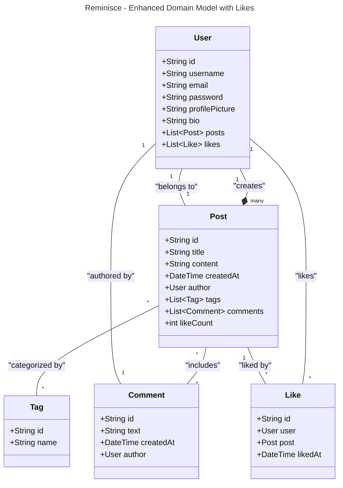

[](https://classroom.github.com/a/DIHvCS29)

# Reminisce

Reminisce is a full-stack social media application designed to capture and share life's most memorable moments. Built on the MERN stack, this platform allows users from around the world to create and explore albums of memories, showcasing notable places visited and adventures experienced.

## Features

### Authentication
- Secure user registration and login system
- JWT (JSON Web Token) implementation for enhanced security
- Google OAuth integration for seamless sign-in options

### Memory Management
- Create, read, update, and delete memories
- Rich text editor for detailed memory descriptions
- Image upload functionality for visual storytelling

### Search and Filtering
- Advanced search capabilities to find memories by tags (e.g., "Europe")
- Title-based search functionality
- Filter memories based on various criteria

### Pagination
- Efficient loading of memories through pagination
- Optimized performance by fetching a limited number of memories at a time

### Memory Details
- Dedicated pages for individual memories with expanded information
- Recommended memories section for related content discovery

### Comments
- Interactive comment system on memory posts
- Engage with other users' experiences and stories

### Client-Side Routing
- Smooth navigation between different sections of the application
- Enhanced user experience with fast page transitions

## Technology Stack

- **Frontend**: React.js
- **Backend**: Node.js with Express.js
- **Database**: MongoDB
- **Authentication**: JWT and Google OAuth
- **State Management**: Redux, Context API
- **Styling**: Styled-components, Tailwind CSS

## Domain Model




## API Endpoints
### Base URL: http://localhost:5002
### Authentication
- POST /auth/signup: Register a new user
- POST /auth/signin: User login
### Reminisce
- GET /posts: Get all memories with pagination
- GET /posts/search: Search for memories by title or tags
- GET /posts/:id: Get a specific memory by ID
- POST /posts: Create a new memory (authenticated)
- PATCH /posts/:id: Update an existing memory (authenticated)
- DELETE /posts/:id: Delete a memory (authenticated)
### Likes
- PATCH /posts/:id/likePost: Like or unlike a memory post (authenticated)
### Comments
- POST /posts/:id/commentPost: Add a comment to a memory post (authenticated)


## Run Instructions
Prerequisites
Ensure the following are installed:

Node.js
MongoDB (running locally or a connection string for a cloud database like MongoDB Atlas)
Setup Instructions
Clone the repository:


```bash
git clone https://github.com/info-6150-fall-2024/final-project-syncspace/reminisce.git
cd reminisce
```
Install dependencies:


```bash
cd server
npm install
```
Set up environment variables:

In the server directory, create a .env file with the following:
env
```
PORT=<APPLICATION_PORT>
MONGO_URI=<your_mongo_connection_string>
```

Start the application:

Start the server:
```
Copy code
cd server
npm start
```
Start the Client:
```
Copy code
cd client
npm start
```

browse http://localhost:<APPLICATION_PORT>/posts


## Team Members

| Name | Email |
|------|-------|
| Sarala Sharanappa Kanakagiri | sharanappakanakagi.s@northeastern.edu |
| Suhas Shetty | shetty.suh@northeastern.edu |
| Ullas Puttaiah | puttaiah.u@northeastern.edu |
| Ayush Patil | patil.ay@northeastern.edu |


## Contact

For general inquiries, please contact our team at sharanappakanakagi.s@northeastern.edu

---

Reminisce: Capturing moments, connecting worlds.
