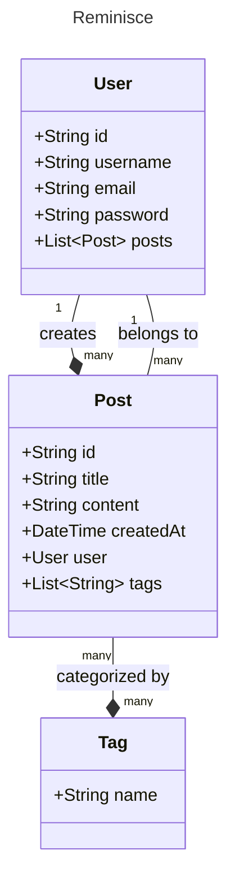

# Reminisce

Reminisce is a full-stack social media application designed to capture and share life's most memorable moments. Built on the MERN stack, this platform allows users from around the world to create and explore albums of memories, showcasing notable places visited and adventures experienced.

## Features

### Authentication
- Secure user registration and login system
- JWT (JSON Web Token) implementation for enhanced security
- Google OAuth integration for seamless sign-in options

### Memory Management
- Create, read, update, and delete memories
- Rich text editor for detailed memory descriptions
- Image upload functionality for visual storytelling

### Search and Filtering
- Advanced search capabilities to find memories by tags (e.g., "Europe")
- Title-based search functionality
- Filter memories based on various criteria

### Pagination
- Efficient loading of memories through pagination
- Optimized performance by fetching a limited number of memories at a time

### Memory Details
- Dedicated pages for individual memories with expanded information
- Recommended memories section for related content discovery

### Comments
- Interactive comment system on memory posts
- Engage with other users' experiences and stories

### Client-Side Routing
- Smooth navigation between different sections of the application
- Enhanced user experience with fast page transitions

## Technology Stack

- **Frontend**: React.js
- **Backend**: Node.js with Express.js
- **Database**: MongoDB
- **Authentication**: JWT and Google OAuth
- **State Management**: [Your chosen state management library, e.g., Redux, Context API]
- **Styling**: [Your chosen CSS framework or methodology, e.g., Styled-components, Tailwind CSS]

## Domain Model

## Getting Started

[Include instructions on how to set up the project locally, including any environment variables, dependencies, and commands to run the application]

## Team Members

| Name | Email |
|------|-------|
| Sarala Sharanappa Kanakagiri | sharanappakanakagi.s@northeastern.edu |
| Suhas Shetty | shetty.suh@northeastern.edu |
| Ullas Puttaiah | puttaiah.u@northeastern.edu |
| Ayush Patil | patil.ay@northeastern.edu |

## Contact

For general inquiries, please contact our team at sharanappakanakagi.s@northeastern.edu

---

Reminisce: Capturing moments, connecting worlds.